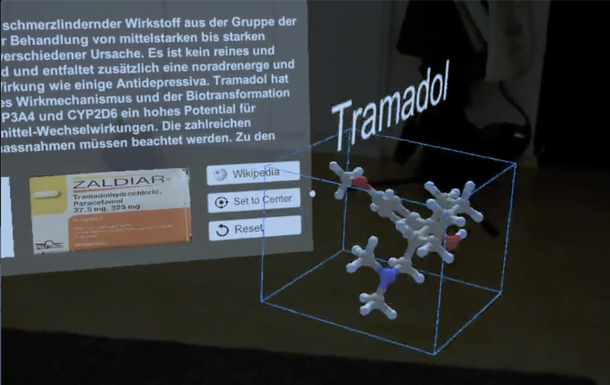
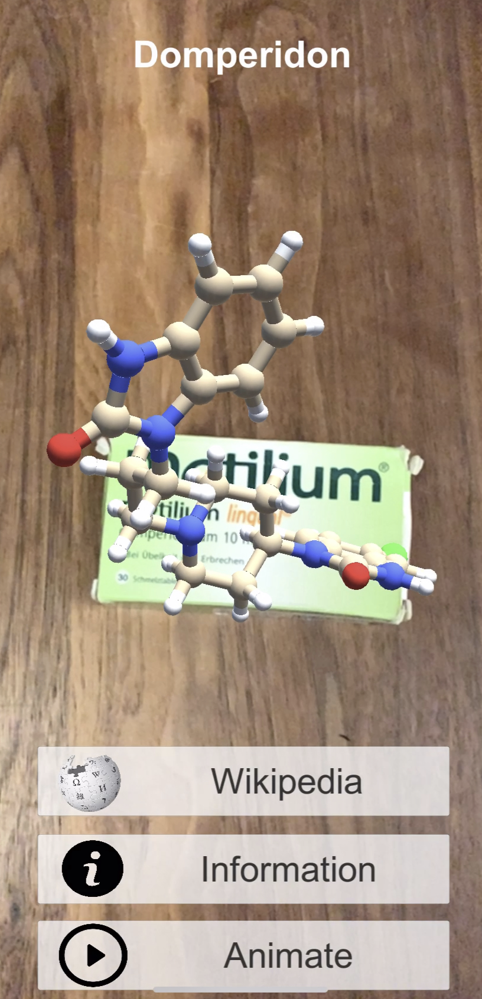

# Moleculeviewer
This Git repository contains the application **MoleculeViewer** and **MoleculeViewerPortable**.

**Please check the attached wiki for all information on the project.**

[MoleculeViewer Wiki](https://gitlab.fhnw.ch/denise.baumann/arreceptorpuzzle/wikis/home)

### What the project is about:

The MoleculeViewer is a server independent application, which is able to track and identify medication packages with image recognition technology.
The project is written with **Unity** and the use of a image recognition technology plugin called **Vuforia**. 

### MoleculeViewer - Hololens version

___

### MoleculeViewerPortable - Smartphone version

